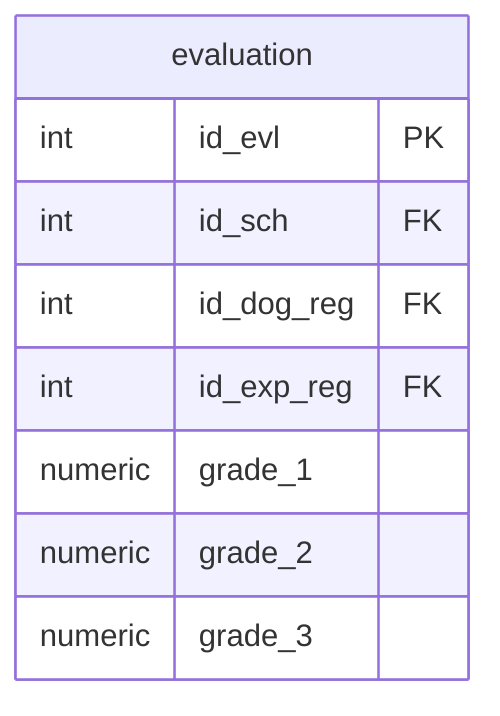

## Условие
Удалить все данные из таблицы оценивания выступлений собак (`evaluation`)
## Схема
В запросе задействована только таблица `evaluation`.

## Решение

```sql
TRUNCATE TABLE evaluation;
```

Альтернативный вариант (если требуется именно `DELETE` без условий):

```sql
DELETE FROM evaluation;
```

## Объяснение

- `TRUNCATE TABLE` — самая быстрая операция удаления всех строк. Она сбрасывает таблицу, не создавая журнала по каждой строке, и сбрасывает счётчики автоинкремента (если есть). Подходит, когда нужно удалить **все** данные без условий.
- `DELETE FROM evaluation` без `WHERE` делает то же самое, но построчно, медленнее и не сбрасывает автоинкремент. Используется, если требуется, чтобы операция логировалась или были триггеры на удаление.
- Ограничений в задании нет, **поэтому** выбираем `TRUNCATE` как оптимальный вариант для полной очистки.

