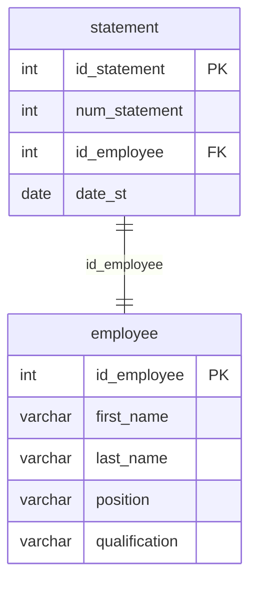

## Условие
Добавить в базу данных новую заправочную ведомость со следующими исходными данными:
- идентификатор ведомости `19`;
- номер ведомости `19`;
- ведомость создал заправщик `Konstantin Ryabov`;
- дата ведомости `2021-06-21`.

## Схема
В запросе задействованы таблицы `statement` и `employee`.



## Решение

```sql
INSERT INTO statement (id_statement, num_statement, id_employee, date_st)
VALUES (19, 19, (SELECT id_employee FROM employee WHERE first_name = 'Konstantin' AND last_name = 'Ryabov'), '2021-06-21');
```

## Объяснение
- Используется полный формат ввода: перечислены все столбцы таблицы `statement`.
- Для поля `id_employee` используется скалярный подзапрос, который возвращает идентификатор сотрудника по имени и фамилии.
- Предполагается, что сотрудник с таким именем существует и имеет должность заправщика (по условию). Если таких несколько, подзапрос вернёт первый (но лучше предусмотреть уникальность).
- Даты заданы в стандартном формате `'YYYY-MM-DD'`.