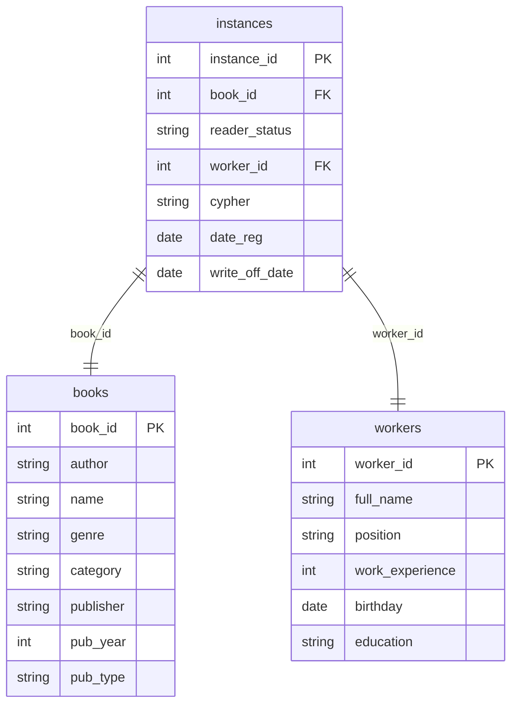

## Условие
Добавить в базу данных информацию о двух новых экземплярах справочника 'Основы пластической деформации наноструктурных материалов':
- идентификаторы экземпляров 64, 65;
- шифры экземпляров А-18236, А-18237;
- экземпляры зарегистрировала Симонова Евгения Артёмовна;
- дата регистрации 2021-06-23.
Использовать полный формат ввода. Дата списания и статус — необязательные поля (NULL).

## Схема
В запросе задействованы таблицы `instances`, `books` и `workers`.



## Решение

```sql
INSERT INTO instances
(instance_id, book_id, reader_status, worker_id, cypher, date_reg, write_off_date)
VALUES
    (64, 
    (SELECT book_id FROM books WHERE name = 'Основы пластической деформации наноструктурных материалов'), 
    NULL, 
    (SELECT worker_id FROM workers WHERE full_name = 'Симонова Евгения Артёмовна'), 
    'А-18236', 
    '2021-06-23', 
    NULL),
    (65, 
    (SELECT book_id FROM books WHERE name = 'Основы пластической деформации наноструктурных материалов'), 
    NULL, 
    (SELECT worker_id FROM workers WHERE full_name = 'Симонова Евгения Артёмовна'), 
    'А-18237', 
    '2021-06-23', 
    NULL);
```

## Объяснение
- Используется полный формат ввода: перечислены все столбцы таблицы `instances` в порядке их определения (согласно схеме).
- Для `book_id` используется подзапрос к таблице `books` по точному названию книги. Предполагается, что книга существует.
- Для `worker_id` — подзапрос к таблице `workers` по полному имени сотрудника. Предполагается, что такой сотрудник есть.
- Необязательные поля `reader_status` и `write_off_date` заполняются `NULL`.
- Даты заданы в формате `'YYYY-MM-DD'`.
- Два экземпляра вставляются одной командой `INSERT ... VALUES` с двумя наборами значений.

## Альтернативные способы
Вот альтернативные способы выполнить ту же вставку данных.
### Альтернатива 1: общие табличные выражения (CTE)

Подзапросы выполняются один раз, результат сохраняется во временные именованные подзапросы, что повышает читаемость и эффективность.

```sql
WITH
    target_book AS (
        SELECT book_id FROM books
        WHERE name = 'Основы пластической деформации наноструктурных материалов'
    ),
    target_worker AS (
        SELECT worker_id FROM workers
        WHERE full_name = 'Симонова Евгения Артёмовна'
    )
INSERT INTO instances
(instance_id, book_id, reader_status, worker_id, cypher, date_reg, write_off_date)
SELECT
    t.instance_id, t.book_id, NULL, t.worker_id, t.cypher, t.date_reg, NULL
FROM (
    VALUES
        (64,
		(SELECT book_id FROM target_book),
		(SELECT worker_id FROM target_worker),
		'А-18236',
		'2021-06-23'),
        (65,
		(SELECT book_id FROM target_book),
		(SELECT worker_id FROM target_worker),
		'А-18237',
		'2021-06-23')
	) AS t(instance_id, book_id, worker_id, cypher, date_reg);
```

> Примечание: в строгих диалектах SQL (например, PostgreSQL) конструкция `VALUES` внутри `FROM` допустима. В MySQL – тоже. Если диалект не поддерживает `VALUES` как производную таблицу, можно использовать `SELECT ... UNION ALL`.

### Альтернатива 2: INSERT ... SELECT с UNION ALL

Без `VALUES`, только `SELECT`. Подзапросы для `book_id` и `worker_id` тоже вынесены, но каждый раз выполняются заново (в большинстве СУБД оптимизатор запомнит результат).

```sql
INSERT INTO instances
(instance_id, book_id, reader_status, worker_id, cypher, date_reg, write_off_date)
SELECT
    64,
    (SELECT book_id FROM books WHERE name = 'Основы пластической деформации наноструктурных материалов'),
    NULL,
    (SELECT worker_id FROM workers WHERE full_name = 'Симонова Евгения Артёмовна'),
    'А-18236',
    '2021-06-23',
    NULL
UNION ALL
SELECT
    65,
    (SELECT book_id FROM books WHERE name = 'Основы пластической деформации наноструктурных материалов'),
    NULL,
    (SELECT worker_id FROM workers WHERE full_name = 'Симонова Евгения Артёмовна'),
    'А-18237',
    '2021-06-23',
    NULL;
```

### Альтернатива 3: предварительное получение ID в переменные (для сред с поддержкой переменных)

Подходит для MySQL, PostgreSQL, Microsoft SQL Server. Ниже пример для MySQL:

```sql
SET @book_id = (SELECT book_id FROM books WHERE name = 'Основы пластической деформации наноструктурных материалов');
SET @worker_id = (SELECT worker_id FROM workers WHERE full_name = 'Симонова Евгения Артёмовна');

INSERT INTO instances (instance_id, book_id, reader_status, worker_id, cypher, date_reg, write_off_date)
VALUES
    (64, @book_id, NULL, @worker_id, 'А-18236', '2021-06-23', NULL),
    (65, @book_id, NULL, @worker_id, 'А-18237', '2021-06-23', NULL);
```

### Альтернатива 4: прямое указание ID (если они известны)

Самый простой и быстрый способ, но требует предварительного знания значений первичных ключей (например, `book_id = 1`, `worker_id = 3`). Если эти данные известны из бизнес-логики или предыдущих запросов, можно просто написать:

```sql
INSERT INTO instances
(instance_id, book_id, reader_status, worker_id, cypher, date_reg, write_off_date)
VALUES
    (64, 1, NULL, 3, 'А-18236', '2021-06-23', NULL),
    (65, 1, NULL, 3, 'А-18237', '2021-06-23', NULL);
```

### Сравнение подходов

| Подход | Преимущества | Недостатки |
|--------|--------------|-------------|
| Исходное решение (`VALUES` с подзапросами) | Лаконично, стандартный SQL | Подзапросы выполняются для каждой строки (может быть неэффективно при большом количестве строк) |
| CTE | Однократное вычисление, чистый код | Не все старые СУБД поддерживают |
| `UNION ALL` | Не нужны временные таблицы, работает везде | Подзапросы повторяются (но часто кешируются) |
| Переменные | Максимальная производительность | Привязанность к конкретной СУБД, дополнительный шаг |
| Прямые ID | Простота, скорость | Требует знания ID, что нарушает принцип независимости от схемы |
