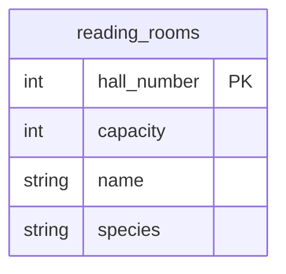

## Условие
Внести в БД информацию о новом читальном зале:
- вместимость зала — 100 мест.
Использовать полный формат, без указания пустых значений. Номер зала имеет ограничение автоинкремент, название и тип зала — необязательные поля (NULL).

## Схема
В запросе задействована только таблица `reading_rooms`.



## Решение

```sql
INSERT INTO reading_rooms (hall_number, capacity, name, species)
VALUES (DEFAULT, 100, NULL, NULL);
```

## Объяснение
- «Полный формат» означает явное перечисление всех столбцов таблицы в списке после имени таблицы.
- Для поля с автоинкрементом (`hall_number`) используется ключевое слово `DEFAULT`, чтобы база данных автоматически сгенерировала следующее значение.
- Необязательные поля `name` и `species` заполняются `NULL`, что соответствует условию «без указания пустых значений» (пустые строки `''` не используются, а явный `NULL` означает отсутствие данных).
- Поле `capacity` получает значение `100`.