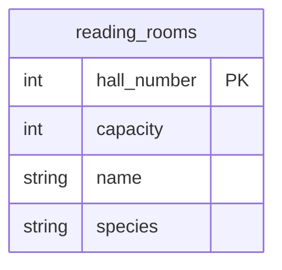

## Условие
В библиотеку завезли столы! Добавьте всем читальным залам по 10 мест.

## Схема
В запросе задействована только таблица `reading_rooms`.



## Решение

```sql
UPDATE reading_rooms
SET capacity = capacity + 10;
```

## Объяснение
- Команда `UPDATE` без условия `WHERE` применяется ко всем строкам таблицы.
- Для каждой строки значение `capacity` увеличивается на 10 с помощью арифметической операции `capacity + 10`.
- Предполагается, что поле `capacity` имеет числовой тип (`int`), что позволяет выполнять сложение.