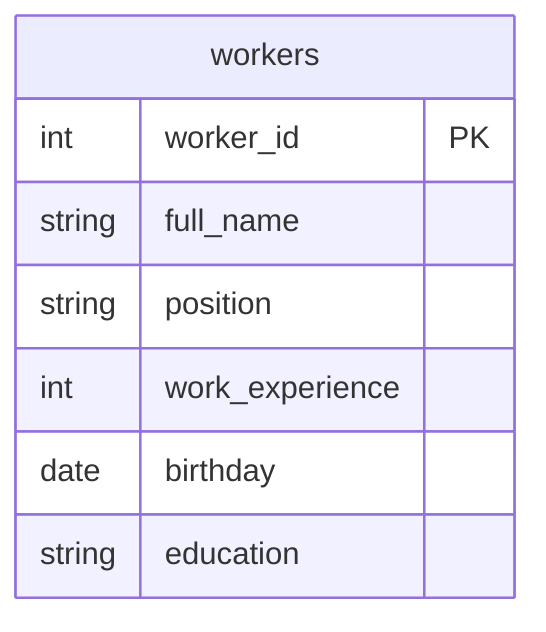

## Условие
Внесите в базу информацию о новом библиографе по имени Богачев Филипп Георгиевич, который родился ровно 25 лет назад, имеет высшее образование и стаж 5 лет. `DATE_SUB()` обязателен!

## Схема
В запросе задействована только таблица `workers`.



## Решение

```sql
INSERT INTO workers (full_name, position, work_experience, birthday, education)
VALUES (
    'Богачев Филипп Георгиевич',
    'библиограф',
    5,
    DATE_SUB(CURDATE(), INTERVAL 25 YEAR),
    'высшее'
);
```

## Объяснение
- `DATE_SUB(CURDATE(), INTERVAL 25 YEAR)` вычисляет дату ровно 25 лет назад от текущей даты. Это соответствует условию «родился ровно 25 лет назад».
- Поле `worker_id` пропущено, так как предполагается автоинкремент (задано в схеме как `PRIMARY KEY` без явного указания `AUTO_INCREMENT`, но по умолчанию в MySQL/PostgreSQL с `SERIAL`).
- Указаны все остальные столбцы: `full_name`, `position` (библиограф), `work_experience` (5), `education` (высшее).
- Использование `DATE_SUB()` строго соответствует требованию задания.