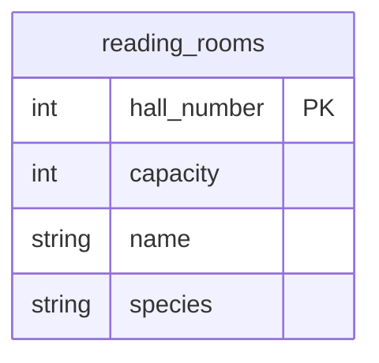

## Условие
Добавьте читальный зал с названием ‘Новый читальный зал’, вместимостью, равной минимальной вместимости среди существующих залов, и видом литературы, равным наиболее часто встречающимся среди существующих залов (вид литературы соответствует типу зала `species`). Номер зала имеет ограничение автоинкремент.

## Схема
В запросе задействована только таблица `reading_rooms`.



## Решение

```sql
INSERT INTO reading_rooms
(hall_number, name, capacity, species)
VALUES (
    DEFAULT,
    'Новый читальный зал',
    (SELECT MIN(capacity) FROM reading_rooms),
    (SELECT species
     FROM reading_rooms
     WHERE species IS NOT NULL
     GROUP BY species
     ORDER BY COUNT(*) DESC
     LIMIT 1)
);
```

## Объяснение
- `hall_number` использует `DEFAULT`, так как поле автоинкрементное.
- `capacity` получает значение минимальной вместимости через подзапрос `SELECT MIN(capacity) FROM reading_rooms`.
- `species` получает наиболее часто встречающийся тип зала (мода):
  - Исключаются `NULL` через `WHERE species IS NOT NULL` (если есть залы без типа, они не учитываются).
  - Группировка по `species`, сортировка по убыванию количества записей.
  - `LIMIT 1` берёт первый, т.е. с самой высокой частотой.
- Если несколько типов имеют одинаковую максимальную частоту, будет выбран один из них (зависит от реализации, обычно первый по порядку группировки). Задание не уточняет, что делать в такой ситуации, но решение корректно.
- Предполагается, что таблица не пуста (иначе подзапросы вернут `NULL`, что может нарушить ограничения). По смыслу задания существующие залы есть.

# Альтернативы
Предлагаю несколько альтернативных решений для добавления нового читального зала с вычисляемыми значениями вместимости (минимум) и вида литературы (мода).

### Альтернатива 1: общие табличные выражения (CTE)

Вычисляем оба значения один раз, затем используем их в `INSERT`. Удобно, когда нужно избежать повторных сканирований таблицы.

```sql
WITH stats AS (
    SELECT
        MIN(capacity) AS min_capacity,
        (
            SELECT species
            FROM reading_rooms
            WHERE species IS NOT NULL
            GROUP BY species
            ORDER BY COUNT(*) DESC
            LIMIT 1
        ) AS mode_species
    FROM reading_rooms
)
INSERT INTO reading_rooms (hall_number, name, capacity, species)
SELECT
    DEFAULT,
    'Новый читальный зал',
    min_capacity,
    mode_species
FROM stats;
```

**Примечание:** `DEFAULT` в `SELECT` работает не во всех СУБД (например, в PostgreSQL нельзя использовать `DEFAULT` в `SELECT`, только в `VALUES`). Для переносимости можно убрать `hall_number` из списка столбцов вообще, если он автоинкрементный. Либо указать `NULL`, если автоинкремент сработает.

Более переносимый вариант (опускаем `hall_number`):

```sql
WITH stats AS (...)
INSERT INTO reading_rooms (name, capacity, species)
SELECT 'Новый читальный зал', min_capacity, mode_species FROM stats;
```

---

### Альтернатива 2: использование переменных (для MySQL / PostgreSQL с DO)

Для MySQL:

```sql
SET @min_cap = (SELECT MIN(capacity) FROM reading_rooms);
SET @mode_species = (
    SELECT species
    FROM reading_rooms
    WHERE species IS NOT NULL
    GROUP BY species
    ORDER BY COUNT(*) DESC
    LIMIT 1
);

INSERT INTO reading_rooms (name, capacity, species)
VALUES ('Новый читальный зал', @min_cap, @mode_species);
```

Для PostgreSQL (в блоке `DO`):

```sql
DO $$
DECLARE
    min_cap INTEGER;
    mode_species TEXT;
BEGIN
    SELECT MIN(capacity) INTO min_cap FROM reading_rooms;
    SELECT species INTO mode_species
    FROM reading_rooms
    WHERE species IS NOT NULL
    GROUP BY species
    ORDER BY COUNT(*) DESC
    LIMIT 1;
    
    INSERT INTO reading_rooms (name, capacity, species)
    VALUES ('Новый читальный зал', min_cap, mode_species);
END $$;
```

### Альтернатива 3: один подзапрос, возвращающий оба значения

Некоторые СУБД позволяют возвращать несколько агрегированных значений из одного подзапроса (через кортеж). Например, в PostgreSQL:

```sql
INSERT INTO reading_rooms (name, capacity, species)
SELECT
    'Новый читальный зал',
    min_capacity,
    mode_species
FROM (
    SELECT
        MIN(capacity) AS min_capacity,
        MODE() WITHIN GROUP (ORDER BY species) AS mode_species
    FROM reading_rooms
    WHERE species IS NOT NULL
) sub;
```

Здесь используется функция `MODE()`, которая возвращает наиболее часто встречающееся значение. Это стандартный SQL (в PostgreSQL есть, в MySQL – `MODE()` только в оконном варианте, в MS SQL – нет прямой). Альтернатива с оконной функцией:

```sql
WITH ranked AS (
    SELECT species, COUNT(*) AS cnt,
           ROW_NUMBER() OVER (ORDER BY COUNT(*) DESC) AS rn
    FROM reading_rooms
    WHERE species IS NOT NULL
    GROUP BY species
)
INSERT INTO reading_rooms (name, capacity, species)
SELECT
    'Новый читальный зал',
    (SELECT MIN(capacity) FROM reading_rooms),
    (SELECT species FROM ranked WHERE rn = 1)
FROM (SELECT 1) dummy;
```

### Альтернатива 4: вставка через `SELECT` без `VALUES` (одиночный `SELECT`)

Даже для одной строки можно использовать `SELECT ... WHERE EXISTS` (чтобы не вставлять, если таблица пуста). Но по условию таблица не пуста.

```sql
INSERT INTO reading_rooms (name, capacity, species)
SELECT
    'Новый читальный зал',
    MIN(capacity),
    (
        SELECT species
        FROM reading_rooms r2
        WHERE species IS NOT NULL
        GROUP BY species
        ORDER BY COUNT(*) DESC
        LIMIT 1
    )
FROM reading_rooms
LIMIT 1;
```

Здесь `MIN(capacity)` вычисляется по всем строкам, а `FROM reading_rooms` вместе с `LIMIT 1` гарантирует, что результат будет одна строка. Не самый красивый, но рабочий вариант.

### Сравнение подходов (для этой задачи)

| Подход                                  | Преимущества                       | Недостатки                                                    |
| --------------------------------------- | ---------------------------------- | ------------------------------------------------------------- |
| Исходный (`VALUES` с подзапросами)      | Простой и стандартный              | Два подзапроса, но таблица маленькая — разница незначительна  |
| CTE                                     | Однократное вычисление, чистый код | Требует поддержки CTE (есть везде, кроме очень старых версий) |
| Переменные                              | Максимальная производительность    | Зависимость от диалекта, два шага                             |
| `MODE()`                                | Элегантно и кратко                 | Не везде есть, не всегда учитывает NULL                       |
| `SELECT ... FROM reading_rooms LIMIT 1` | Без CTE и переменных               | Логически избыточен, но работает                              |
### Дополнительные замечания по логике

- **Что делать, если несколько видов литературы имеют одинаковую максимальную частоту?**  
  Исходное решение (и большинство альтернатив) выберет один из них (первый по алфавиту или по порядку группировки). Если требуется строгое соответствие («наиболее часто встречающийся» в единственном числе, а их несколько), задание обычно не специфицирует. При необходимости можно добавить `ORDER BY species` для детерминированности.

- **Что делать, если таблица пуста?**  
  Подзапросы вернут `NULL`, и вставка либо не удастся (если `capacity` и `species` имеют ограничение `NOT NULL`), либо вставит `NULL`, что нелогично. По смыслу задачи существующие залы есть, поэтому это не рассматривается.

- **Автоинкремент**  
  Поле `hall_number` лучше вообще не указывать в `INSERT`, чтобы оно заполнилось автоматически. В исходном решении указано `DEFAULT` – это корректно, но не во всех СУБД поддерживается в `VALUES`. Поэтому в альтернативах я часто опускаю это поле.

Рекомендуемый вариант для переносимости и ясности – **CTE с опущенным `hall_number`**:

```sql
WITH stats AS (
    SELECT
        MIN(capacity) AS min_capacity,
        (
            SELECT species
            FROM reading_rooms
            WHERE species IS NOT NULL
            GROUP BY species
            ORDER BY COUNT(*) DESC
            LIMIT 1
        ) AS mode_species
    FROM reading_rooms
)
INSERT INTO reading_rooms (name, capacity, species)
SELECT 'Новый читальный зал', min_capacity, mode_species
FROM stats;
```