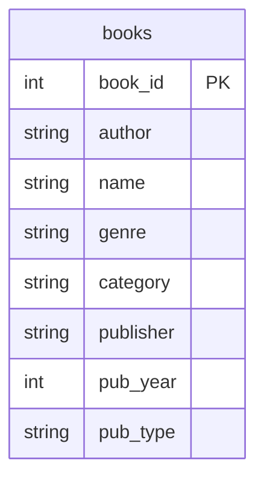

## Условие
Запишите названия англоязычных книг так же, как русские: первая буква заглавная, остальные строчные. Для отбора англоязычных названий книг используйте регулярные выражения. Обязательно использовать `REGEXP`!

## Схема
В запросе задействована только таблица `books`.



## Решение

```sql
UPDATE books
SET name = CONCAT(
    UPPER(SUBSTRING(name, 1, 1)),
    LOWER(SUBSTRING(name, 2))
)
WHERE name REGEXP '[A-Za-z]';
```

## Объяснение
- `WHERE name REGEXP '[A-Za-z]'` отбирает книги, в названии которых встречается хотя бы одна латинская буква (признак англоязычного названия). Альтернативно можно использовать `REGEXP '^[A-Za-z]'` для отбора названий, начинающихся с латиницы.
- `SUBSTRING(name, 1, 1)` извлекает первый символ, `UPPER(...)` делает его заглавным.
- `SUBSTRING(name, 2)` извлекает все символы со второго по конец, `LOWER(...)` приводит их к строчным.
- `CONCAT(...)` объединяет преобразованные части в одно строковое значение.
- Если название состоит из одного символа, `SUBSTRING(name, 2)` вернёт пустую строку, что корректно.
- Предполагается, что поле `name` не содержит `NULL` (или такие строки не попадут под условие `REGEXP`).
- Функции `UPPER`, `LOWER`, `CONCAT`, `SUBSTRING` и `REGEXP` доступны в MySQL и PostgreSQL (в PostgreSQL используется `~` вместо `REGEXP`, но в задании указан `REGEXP` — значит, среда MySQL или MariaDB).