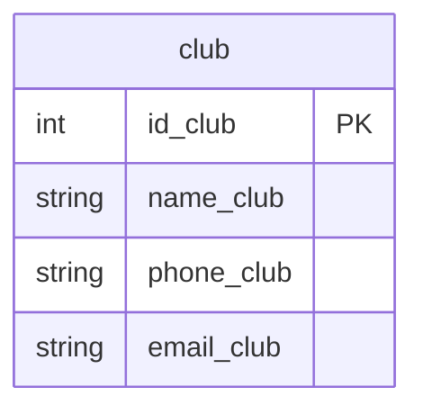

## Условие
Новый начальник сказал, что телефоны в базе должны начинаться не с восьмёрки, а с +7. Ваша задача — исправить номера телефонов в табличке клубов. Обратите внимание, что нужно изменять только те номера, которые начинаются с восьмёрки. Использовать функцию `CONCAT`. `WHERE` обязателен!

## Схема
В запросе задействована только таблица `club`.



## Решение

```sql
UPDATE club
SET phone_club = CONCAT('+7', SUBSTRING(phone_club, 2))
WHERE phone_club LIKE '8%';
```

## Объяснение
- `WHERE phone_club LIKE '8%'` отбирает только те номера, которые начинаются с цифры 8. Это обязательное условие.
- `SUBSTRING(phone_club, 2)` извлекает все символы начиная со второй позиции (т.е. без первой восьмёрки).
- `CONCAT('+7', ...)` добавляет в начало `+7`.
- Номер «89123456789» превратится в «+79123456789».
- Если номер содержит не только цифры (например, скобки или пробелы), но начинается с 8, то удалится только первый символ, а остальное останется без изменений — это корректно, так как задание требует заменить начальную 8 на +7.