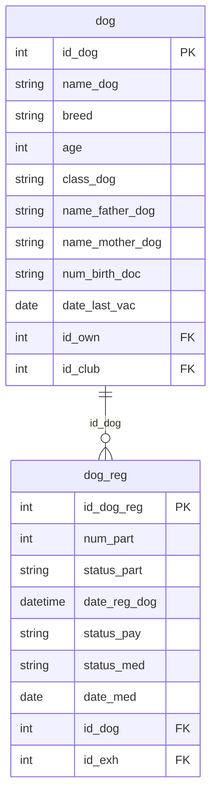

## Условие
Удалите всех собак, которые ни разу не регистрировались на выставки или не принадлежат ни к какому клубу. `NOT EXISTS` обязателен!

## Схема
В запросе задействованы таблицы `dog` и `dog_reg`.



## Решение

```sql
DELETE FROM dog
WHERE id_club IS NULL
   OR NOT EXISTS (
       SELECT 1
       FROM dog_reg
       WHERE dog_reg.id_dog = dog.id_dog
   );
```

## Объяснение
- Условие `id_club IS NULL` отбирает собак, не принадлежащих ни к одному клубу.
- `NOT EXISTS` проверяет отсутствие хотя бы одной записи в `dog_reg` для данной собаки.
- Важно: `OR` объединяет оба условия. Собака будет удалена, если выполнено хотя бы одно из них.
- В подзапросе `SELECT 1` — неважно, что выбирать, важно только существование строк.
- Связь по внешнему ключу: `dog_reg.id_dog = dog.id_dog`.
- Ограничение `NOT EXISTS` использовано для проверки отсутствия регистраций (согласно требованию задания). Для проверки принадлежности к клубу используется прямое условие `IS NULL`, так как `NOT EXISTS` здесь не требуется.