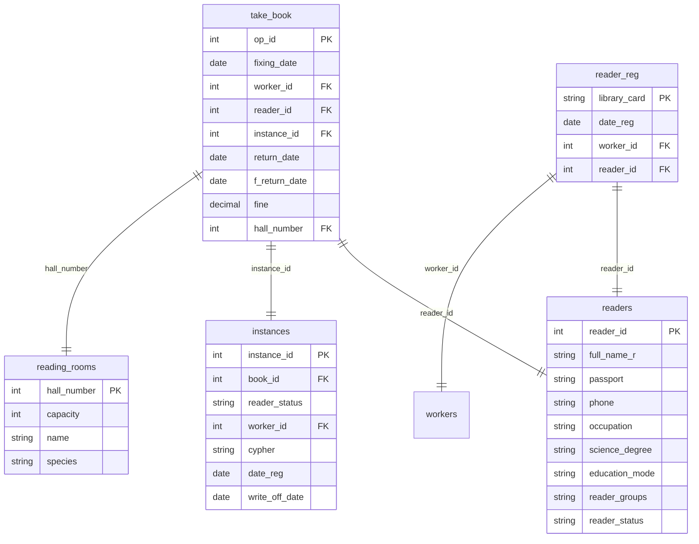

## Условие
Ярослав Владимирович взял в библиотеке экземпляр книги, который читатели брали наибольшее количество раз, при этом экземпляр находился в библиотеке и не был списан. Среди всех экземпляров, которые были взяты наибольшее количество раз, взятый Ярославом оказался в последний раз возвращен раньше всех. Информацию в базу заносил тот же работник, который регистрировал Ярослава в библиотеке. `fixing_date` и `f_return_date` равны плюс недельный интервал и минус недельный интервал от текущей даты соответственно. В качестве зала укажите "Читальный зал №2 учебной литературы". Внесите запись в базу.

## Схема
В запросе задействованы таблицы `take_book`, `readers`, `reader_reg`, `instances`, `reading_rooms`.



## Решение

```sql
INSERT INTO take_book
(fixing_date, worker_id, reader_id, instance_id, return_date, f_return_date, fine, hall_number)
-- про ярослава
WITH reader_data AS (
    SELECT 
        r.reader_id,
        rr.worker_id
    FROM readers r
    JOIN reader_reg rr ON r.reader_id = rr.reader_id
    WHERE r.full_name_r LIKE '%Ярослав Владимирович%'
),

-- сколько раз брали
instance_stats AS (
    SELECT 
        i.instance_id,
        COUNT(t.op_id) AS borrow_count,
        COALESCE(MAX(t.return_date), '1900-01-01') AS last_return_date
    FROM instances i
    JOIN take_book t ON i.instance_id = t.instance_id
    WHERE
        i.write_off_date IS NULL
        AND (i.reader_status != 'Списан' OR i.reader_status IS NULL)
        AND NOT EXISTS (
            SELECT 1 FROM take_book tb 
            WHERE tb.instance_id = i.instance_id AND tb.return_date IS NULL
        )
    GROUP BY i.instance_id
),

-- нужный экземпляр
target_instance AS (
    SELECT instance_id
    FROM instance_stats
    ORDER BY borrow_count DESC, last_return_date ASC
    LIMIT 1
),

-- номер зала
target_hall AS (
    SELECT hall_number
    FROM reading_rooms
    WHERE name LIKE '%Читальный зал №2 учебной литературы%'
)

SELECT
    CURDATE() - INTERVAL 7 DAY,
    rd.worker_id,
    rd.reader_id,
    ti.instance_id,
    NULL,
    CURDATE() + INTERVAL 7 DAY,
    NULL,
    th.hall_number
FROM reader_data rd
CROSS JOIN target_instance ti
CROSS JOIN target_hall th;
```

## Объяснение

- **`reader_data`** – получает `reader_id` и `worker_id` (того же работника, который регистрировал Ярослава) по полному имени читателя.
- **`instance_stats`** – для каждого несписанного экземпляра считает количество выдач (`borrow_count`) и дату последнего возврата (`last_return_date`). Экземпляры без выдач имеют `borrow_count = 0`, а `last_return_date` заменяется на `1900-01-01` с помощью `COALESCE`, чтобы они не влияли на сортировку.
- **`max_borrow`** – максимальное значение `borrow_count` среди всех экземпляров.
- **`target_instance`** – выбирает экземпляр с максимальным числом выдач, среди них сортирует по `last_return_date ASC` (самый ранний последний возврат) и берёт первый.
- **`target_hall`** – номер зала по его названию.
- **Основной `INSERT`** – объединяет три CTE через `CROSS JOIN` (каждое возвращает одну строку) и формирует запись:
  - `fixing_date` = текущая дата + 7 дней.
  - `f_return_date` = текущая дата − 7 дней (по условию).
  - `return_date` и `fine` – `NULL`.
- CTE делают запрос читаемым и модульным. Для работы требуется MySQL 8.0 или выше.