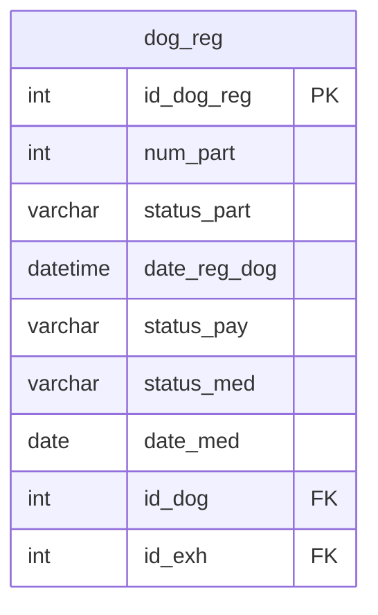

## Условие
Удалить все записи из таблицы регистрации участников выставок (`dog_reg`), если собака не прошла медосмотр (поле `status_med = 'Not passed'`).

## Схема
В запросе задействована только таблица `dog_reg`.


## Решение

```sql
DELETE FROM dog_reg
WHERE status_med = 'Not passed';
```

## Объяснение
- Условие `WHERE status_med = 'Not passed'` отбирает только те строки, где медосмотр не пройден.
- Команда `DELETE` без дополнительных ограничений удаляет все такие записи.
- Поле `status_med` имеет тип `varchar` и содержит значения `'Passed'` или `'Not passed'` согласно схеме.