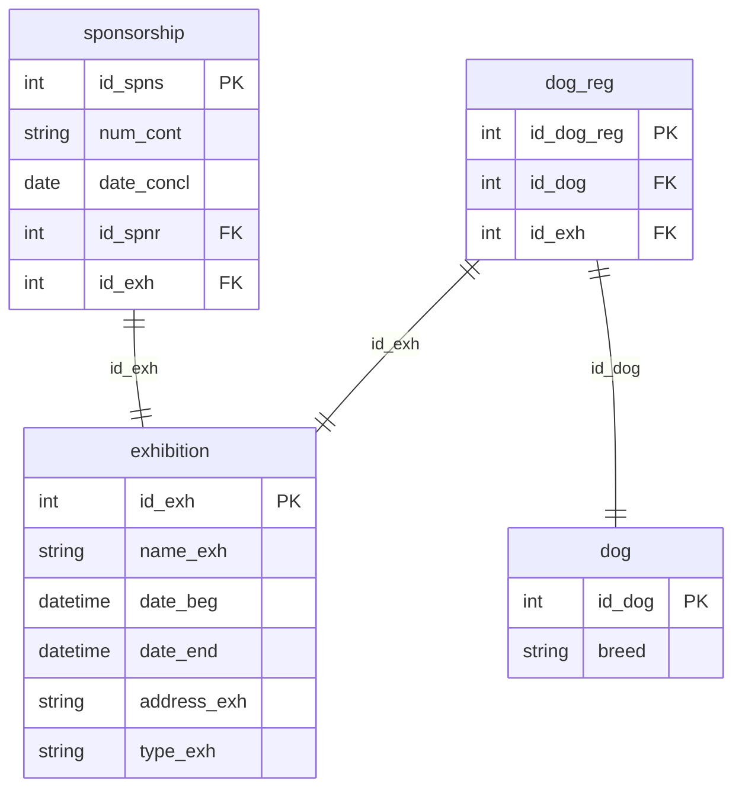

## Условие
Для всех выставок, которые проходили в Сокольниках (`Sokolniki`) и в которых участвовали собаки породы Чау-чау (`Chow-chow`) (оба условия должны выполняться одновременно), добавьте спонсора с `id_spnr = 4`, если он ещё не был спонсором на данной выставке. `num_cont` укажите как `'ST-AR-1443-0007'`, а дату — как дату начала соответствующей выставки.

## Схема
В запросе задействованы таблицы `sponsorship`, `exhibition`, `dog_reg`, `dog`.



## Решение

```sql
INSERT INTO sponsorship (num_cont, date_concl, id_spnr, id_exh)
SELECT 
    'ST-AR-1443-0007' AS num_cont,
    e.date_beg AS date_concl,
    4 AS id_spnr,
    e.id_exh
FROM exhibition e
WHERE
e.address_exh LIKE '%Sokolniki%' AND
EXISTS (
      SELECT 1
      FROM dog_reg dr
      JOIN dog d ON dr.id_dog = d.id_dog
      WHERE dr.id_exh = e.id_exh AND d.breed = 'Chow-chow'
) AND
NOT EXISTS (
      SELECT 1
      FROM sponsorship s
      WHERE s.id_exh = e.id_exh
        AND s.id_spnr = 4
);
```

## Объяснение
- Основной запрос выбирает выставки из `exhibition`, удовлетворяющие двум условиям:
  1. Адрес содержит «Sokolniki» (используем `LIKE '%Sokolniki%'`, так как в адресе может быть полное название).
  2. Существует хотя бы одна регистрация собаки породы «Chow-chow» на эту выставку (подзапрос с `EXISTS` и `JOIN` `dog`).
- Для каждой такой выставки проверяется, что спонсор с `id_spnr = 4` ещё не добавлен на неё (`NOT EXISTS` по `sponsorship`).
- Если проверки пройдены, вставляется строка в `sponsorship` с:
  - `num_cont = 'ST-AR-1443-0007'`
  - `date_concl = e.date_beg` (дата начала выставки)
  - `id_spnr = 4`
  - `id_exh = e.id_exh`
- `id_spns` — первичный ключ, предполагается автоинкремент, поэтому не указывается.
- Если одна выставка соответствует критериям, но спонсор 4 уже есть, вставка не произойдёт.