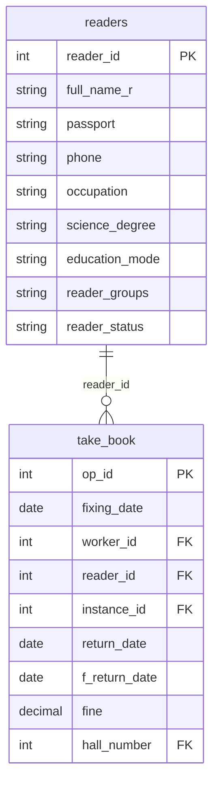

## Условие
Удалить читателей (`readers`), которые не брали ни одной книги (нет записей в таблице `take_book`).

## Схема
В запросе задействованы таблицы `readers` и `take_book`.



## Решение

```sql
DELETE FROM readers
WHERE NOT EXISTS (
    SELECT 1
    FROM take_book
    WHERE take_book.reader_id = readers.reader_id
);
```

## Объяснение
- `NOT EXISTS` проверяет, что для данного читателя нет ни одной строки в `take_book`.
- Подзапрос возвращает `1` (неважно что) для каждого `reader_id`, который встречается в `take_book`.
- Если подзапрос не находит ни одной записи, условие `NOT EXISTS` истинно, и читатель удаляется.
- Такой способ безопаснее, чем `LEFT JOIN ... WHERE take_book.reader_id IS NULL`, особенно если на `take_book` есть индексы, и он правильно обрабатывает NULL в связке.
- Ограничений по использованию CTE или оконных функций в задании нет, но запрос с `NOT EXISTS` является классическим и эффективным.
