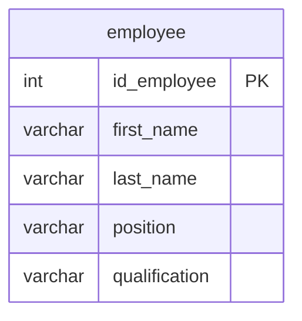

## Условие
Добавить в базу данных информацию о новом водителе: Peter Fedorov принимается на работу на должность refueler (без квалификации). Идентификатор сотрудника — 29. Использовать полный формат ввода.

## Схема
В запросе задействована только таблица `employee`.



## Решение

```sql
INSERT INTO employee (id_employee, first_name, last_name, position, qualification)
VALUES (29, 'Peter', 'Fedorov', 'refueler', NULL);
```

## Объяснение
- «Полный формат ввода» означает явное перечисление всех столбцов таблицы в списке после имени таблицы.
- Для сотрудника указаны: `id_employee = 29`, `first_name = 'Peter'`, `last_name = 'Fedorov'`, `position = 'refueler'`.
- Поскольку квалификация отсутствует, передаётся `NULL` (допустимо, если столбец допускает NULL).
- Значения перечислены в том же порядке, что и столбцы в списке.