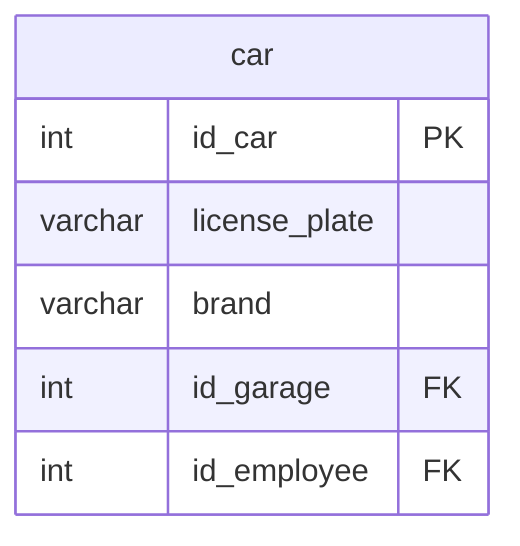

## Условие
Удалить из базы данных все автомобили марок `UAZ` или `GAZ`, которые не закреплены за водителем (`id_employee IS NULL`) и не имеют государственного номера (`license_plate IS NULL`).

## Схема
В запросе задействована только таблица `car`.



## Решение

```sql
DELETE FROM car
WHERE (brand = 'UAZ' OR brand = 'GAZ')
  AND id_employee IS NULL
  AND license_plate IS NULL;
```

## Объяснение
- Условие `(brand = 'UAZ' OR brand = 'GAZ')` отбирает автомобили нужных марок. Скобки обязательны для правильной группировки.
- `id_employee IS NULL` проверяет, что автомобиль не закреплён ни за одним водителем.
- `license_plate IS NULL` проверяет отсутствие государственного номера.
- Все три условия соединяются через `AND`, поэтому удаляются только те автомобили, которые удовлетворяют всем критериям одновременно.
- Если госномер может быть пустой строкой `''`, а не `NULL`, условие следует изменить на `license_plate IS NULL OR license_plate = ''`. Исходя из фразы «не имеют гос. номер» в задании, предполагается именно `NULL`.