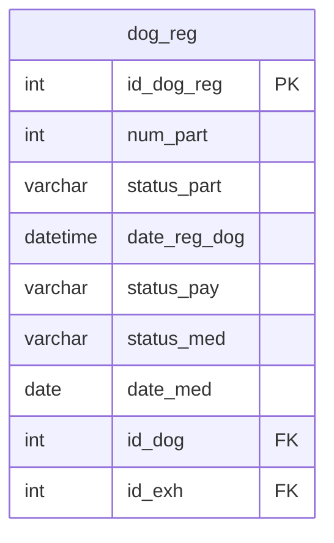

## Условие
Установить статус медосмотра пройден (`Passed`) для всех регистраций участников выставок (таблица `dog_reg`).

## Схема
В запросе задействована только таблица `dog_reg`.



## Решение

```sql
UPDATE dog_reg
SET status_med = 'Passed';
```

## Объяснение
- Команда `UPDATE` без условия `WHERE` изменяет все строки таблицы.
- В столбец `status_med` для каждой записи записывается значение `'Passed'`.
- Даты прохождения медосмотра (`date_med`) остаются без изменений, так как задание требует изменить только статус.
- Если требуется также проставить текущую дату в `date_med`, это можно добавить: `SET status_med = 'Passed', date_med = CURRENT_DATE`. Но по условию — только статус.