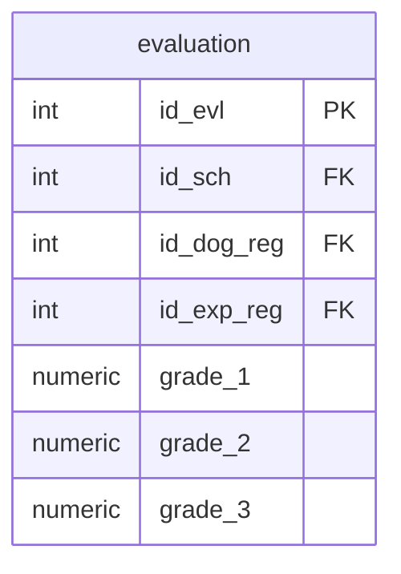

## Условие
В записи таблицы оценивания выступлений (`evaluation`) с идентификационным номером `id_evl = 7` все оценки были занижены на 1 балл. Внесите изменения в базу данных.

## Схема
В запросе задействована только таблица `evaluation`.



## Решение

```sql
UPDATE evaluation
SET grade_1 = grade_1 + 1,
    grade_2 = grade_2 + 1,
    grade_3 = grade_3 + 1
WHERE id_evl = 7;
```

## Объяснение
- `WHERE id_evl = 7` ограничивает обновление только одной записью.
- Для каждой оценки (`grade_1`, `grade_2`, `grade_3`) используется арифметическое выражение: текущее значение увеличивается на 1.
- Так как оценки были занижены, прибавление 1 исправляет ошибку.
- Тип данных `numeric` поддерживает сложение с целым числом.