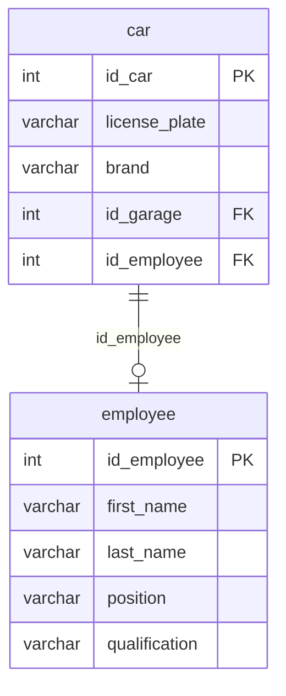

## Условие
Закрепить автомобиль с гос. номером `O067PO` за водителем `Mihail Titov`.

## Схема
В запросе задействованы таблицы `car` и `employee`.



## Решение

```sql
UPDATE car
SET id_employee = (
    SELECT id_employee
    FROM employee
    WHERE first_name = 'Mihail' AND last_name = 'Titov'
)
WHERE license_plate = 'O067PO';
```

## Объяснение
- Внутренний подзапрос находит `id_employee` для водителя `Mihail Titov`.
- Внешний `UPDATE` находит автомобиль по госномеру `O067PO` и присваивает его полю `id_employee` найденное значение.
- Если водитель с таким именем и фамилией отсутствует, подзапрос вернёт `NULL`, и автомобиль будет откреплён от всех водителей. Предполагается, что водитель существует.
- Если госномер записан в точности как `O067PO` (с учётом регистра, но в PostgreSQL по умолчанию регистр важен; лучше уточнить, но в задании так).