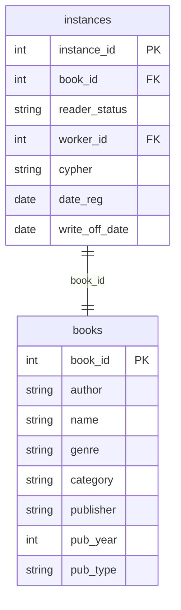

## Условие
Списать все экземпляры книг издательства «Физматлит», изданные ранее 2011 года. Дата списания — 01.06.2021, статус — «Списан».

## Схема
В запросе задействованы таблицы `instances` и `books`.



## Решение

```sql
UPDATE instances
SET write_off_date = '2021-06-01',
    reader_status = 'Списан'
WHERE book_id IN (
    SELECT book_id
    FROM books
    WHERE publisher = 'Физматлит'
      AND pub_year < 2011
);
```

## Объяснение
- Подзапрос `SELECT book_id FROM books ...` находит все идентификаторы книг нужного издательства и года издания.
- Внешний `UPDATE` изменяет `write_off_date` и `reader_status` для всех экземпляров, у которых `book_id` входит в этот список.
- Использование `IN` с подзапросом понятно и эффективно, если подзапрос возвращает небольшое количество записей.
- Если некоторые экземпляры уже были списаны, их статус и дата всё равно обновятся согласно условию (повторное списание допустимо).
- Дата задана в формате `'YYYY-MM-DD'`, что соответствует стандарту SQL.